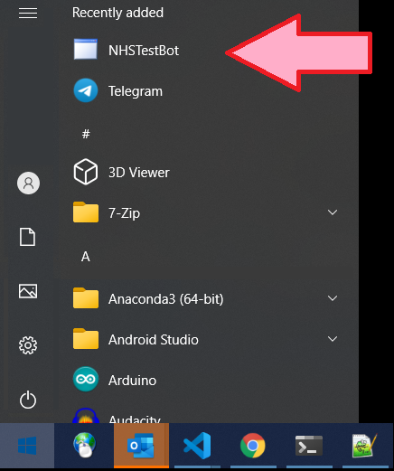
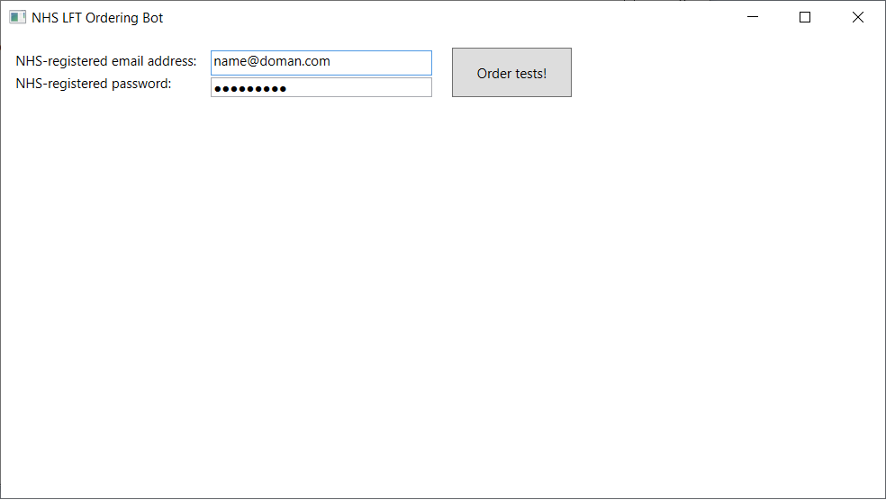

# NHS Lateral Flow Checker Jan 2022

This is a bot which orders Lateral Flow Tests from the NHS Website.

It requires you to enter your NHS-registered username and password, and it does the rest for you.

It runs on your local machine and does not send your email address or password anywhere except to the NHS website. Check the source if you are so inclined.

### Requirements

You must:

- Have an NHS-registered account.
- The account must have an address registered to it (this will automatically be the case if you have ordered tests online before).
- Currently only available for Windows.

### Installation 

TODO: upload release and make release into a link.

1. Download the release.
2. Run `setup.exe`.
3. Click `Install`.

The program will open automatically after being installed.

### Running after install

1. The program will be added to the Start Menu automatically be the installation.
2. Enter username and password and run the program.

### Legal disclaimer

There is nothing in this code which infringes the gov.uk (terms and conditions)[https://www.gov.uk/help/terms-conditions]. It is not a denial-of-service attack: it makes, at most, one request every five minutes. 

This code does not introduce, or attempt to introduce, viruses, trojans, worms, logic bombs or any other material that’s malicious or technologically harmful. It does not attempt gain unauthorised access to GOV.UK, the server on which it’s stored or any server, computer or database connected to it.

The NHS prevents Covid tests being ordered more than once every 24 hours.