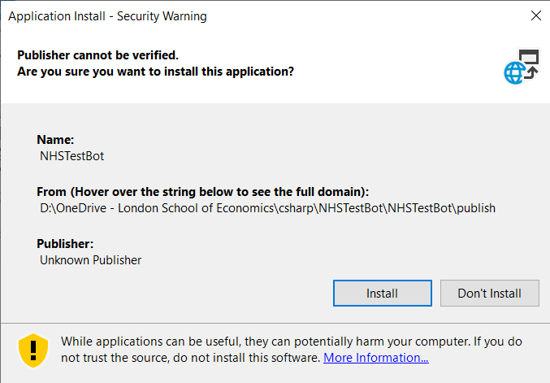

# Automated NHS Lateral Flow Test Ordering

This is a simple piece of software which orders Lateral Flow Tests from the GOV.UK Website.

It requires you to enter your NHS-registered username and password. It then opens a browser and completes the web form for you. If tests are unavailable, it waits five minutes and retries, until tests are available.

It runs on your local machine and does not send your email address or password anywhere, other than into the NHS website. Your AES-encrypted password [(RFC2898)](https://datatracker.ietf.org/doc/html/rfc2898) is also stored locally on your file system so you do not have to enter it each time you run the program. You can confirm this by checking the [source](NHSTestBot/MainWindow.xaml.cs).

### Requirements

You must have:

1. An NHS account login. If you are not sure whether you have one, or what email address/password you used, you can check [here](https://www.nhsapp.service.nhs.uk/login).
2. An address registered to this account. This will automatically be the case if you have ordered tests online before.

The software is currently only available for Windows.

### Installation 

1. Download and unzip the [release](https://github.com/samrickman/lft-bot-nhs/releases/download/v001/release.zip).
2. Run `setup.exe`.
3. Click `Install`.




The program will open automatically after being installed.

### Running after install

1. The program will be added to the Start Menu automatically be the installation.
2. Enter username and password and run the program.


# Installing from source (Windows only)

If you wish to build from source, you will need Microsoft Visual Studio 2019 or later (not just VS code). The easiest way is to open the project in Visual Studio and click `Build` -> `Publish NHSTestBot`. However, you can also do it from the command line:  

```
git clone https://github.com/samrickman/lft-bot-nhs
path\to\msbuild.exe .\NHSTestBot\NHSTestBot.csproj /p:Configuration=Release
```

If you are unsure of your path to msbuild, follow the instructions [here](https://stackoverflow.com/a/328133/12545041).

The app uses .NET Framework so cannot be built from source on Mac/Linux.

### Legal information

There is nothing in this code which infringes the GOV.UK [terms and conditions](https://www.gov.uk/help/terms-conditions). This is not a denial-of-service attack: it makes, at most, one request every five minutes. 

This code does not introduce, or attempt to introduce, viruses, trojans, worms, logic bombs or any other material that’s malicious or technologically harmful. It does not attempt gain unauthorised access to GOV.UK, the server on which it’s stored or any server, computer or database connected to it.

The NHS prevents Covid-19 tests being ordered more than once every 24 hours and this program does not circumvent, or attempt to circumvent, this limit.